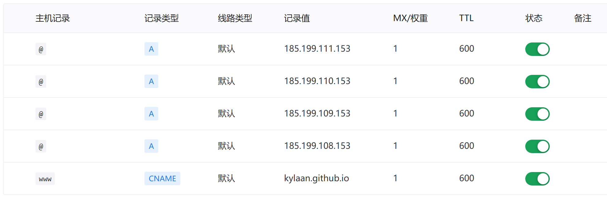

## [宝塔](bt.cn)
本站域名由宝塔新推出的域名服务提供。
使用自带的DNS解析服务。

## 使用
1. 添加Github Pages服务器ip:`185.199.111.153 `为`A记录`解析.
共有四个ip，从`108`到`111`随机分配，防止出问题可以把这四个都配置解析。

    *官方建议使用`www-CNAME`记录，实际都可以选择*
2. 在`username.github.io`仓库配置页面（或`respo-Settings-Pages`）下拉选择`Custom domain`填入域名即可自动解析，JUST WAIT.
